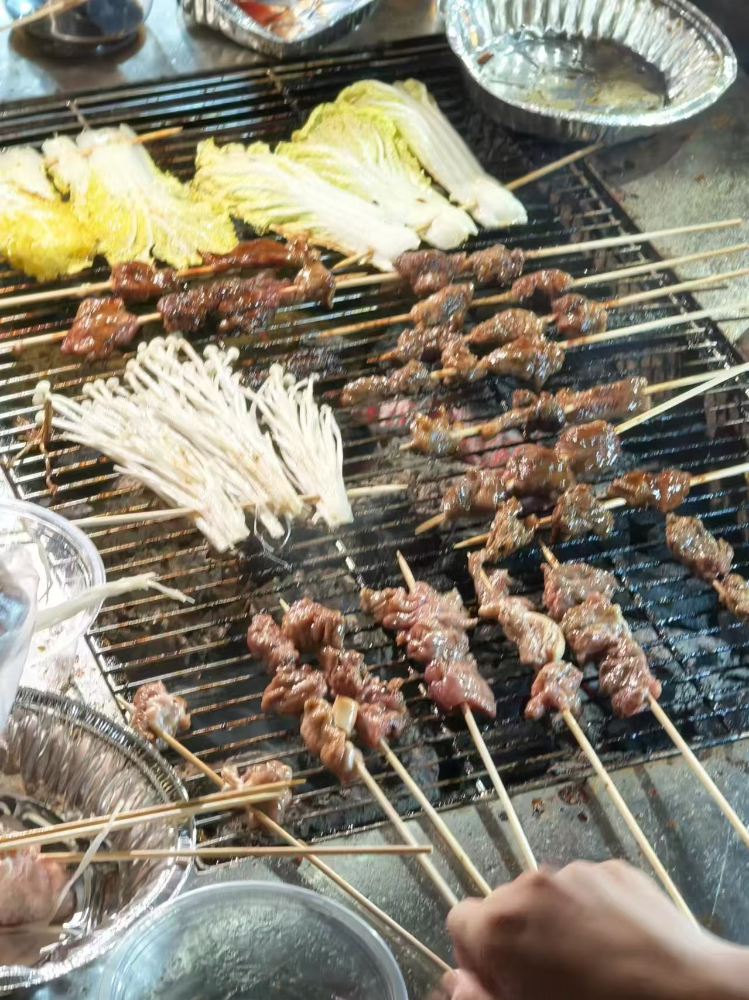

# 软工作业自我介绍

## 摘要

就大学开始介绍吧，再往前显得冗长而拖沓。

先说结论，作者是一个缺乏足够行动力的理想主义者，很多事情上会幻想自己没有一点纰漏，但是真到了要做的时候总是提不起兴趣。

虽然偶尔会打一下鸡血，但是如果没有后续的推动，缺乏后劲，很快就会回到温暖的被窝开始躺尸。这种性格在很多事上都害了作者，各种半途而废，如今也有在尝试做出改变。

## 校园生活

2023年9月，作者和另外三万多人中的大部分一样，一脸懵逼地踏入大学，无法避免四处的新奇，于是还算有动力地探索过一些力所能及的地方。

勉强四肢还能支持我进行一定限度的活动。

认识了一些人，偶尔会有小聚餐。

最后聊聊学习，作者个人是比较懒的，成绩这块大多期末临时抱佛脚，而幸亏运气有点小好，每次抱到的都还算好脚。

身边有很多优秀的人，包括但不限于已经实习许久的程序大佬，已经手握几篇不知道什么期刊论文的科研大佬，这总是令作者陷入羡慕和自身啥都没干成的惭愧，然后就会奋起学一段时间，然后再被被子吃掉几天。目前有学django、mysql、git、在学springboot，也有接触过pytorch和一些深度学习知识。虽然会的很少，而且亲手完整项目只做过一个GitHub上的mmpose复现，也还没有去主动学八股，但胜在坚持（？），好歹没有彻底自暴自弃，偶尔来兴趣了就学个一两个小时。后面相信到死到临头的时候作者会慢慢蠕动到能入职的程度的。

​			

## 课余

闲下来就打游戏，没有太深入地玩某一类，基本啥类型都玩玩

偶尔来兴致了叫上三两小友出去吃点好吃的到处逛逛

其他好像没什么了，说来惭愧。

